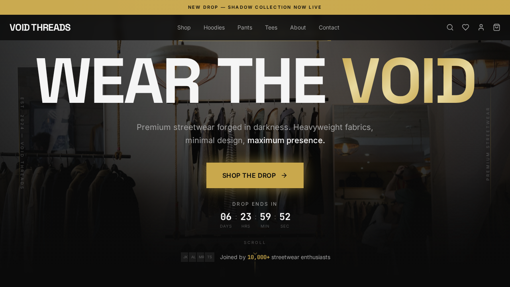
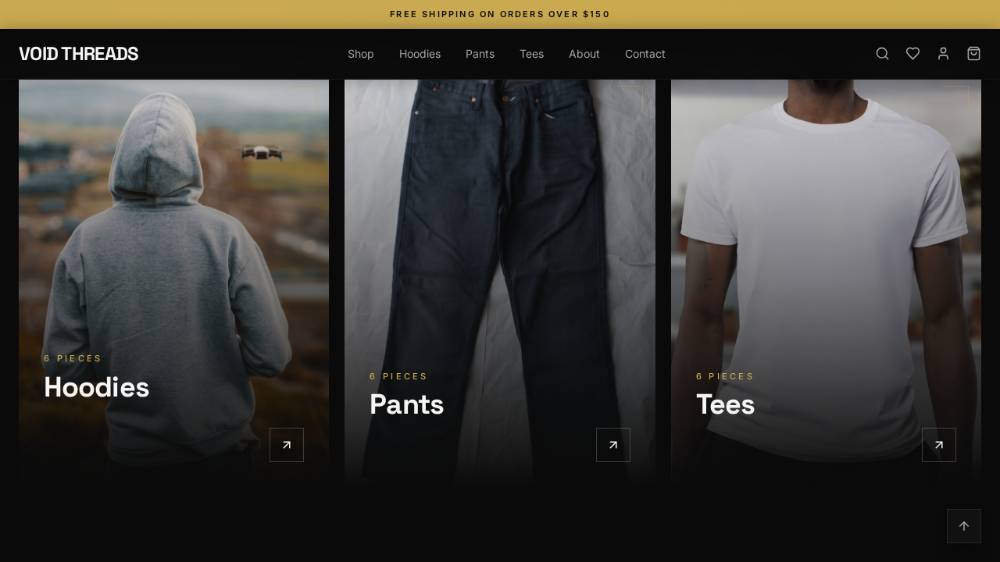
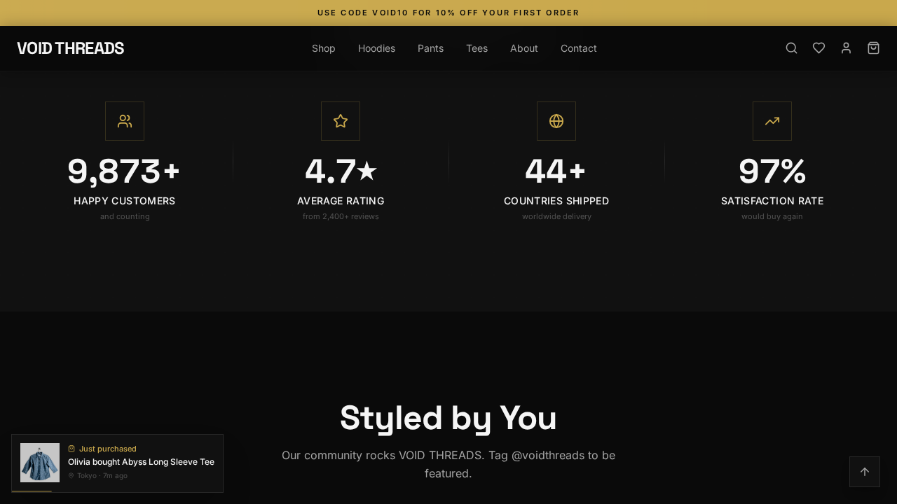
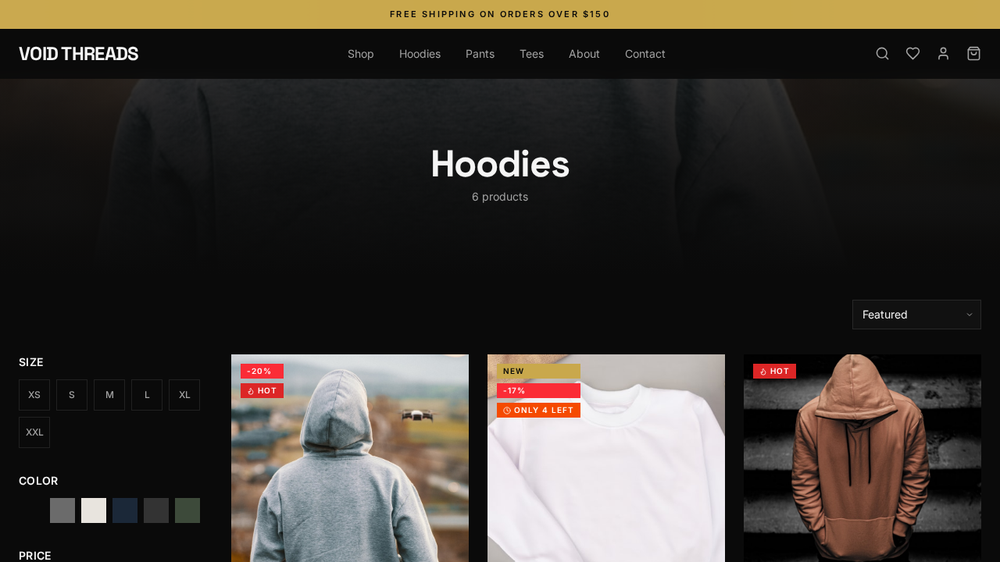
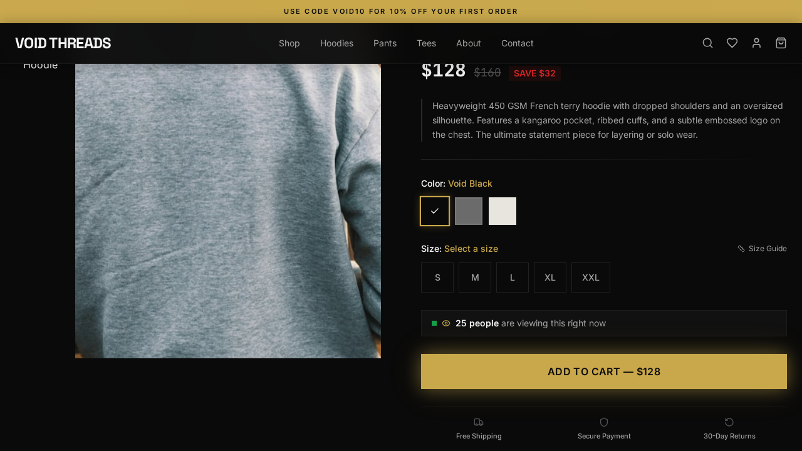
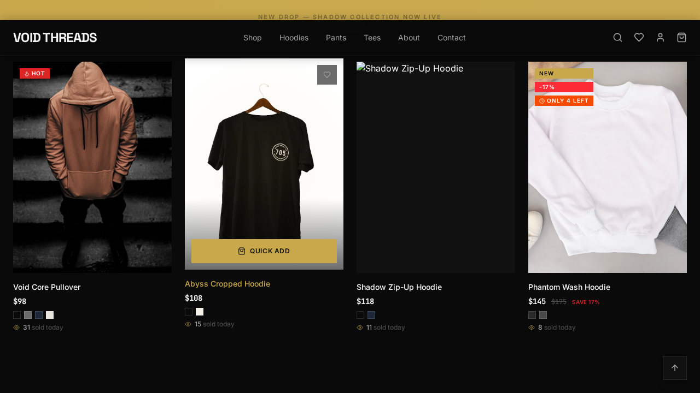
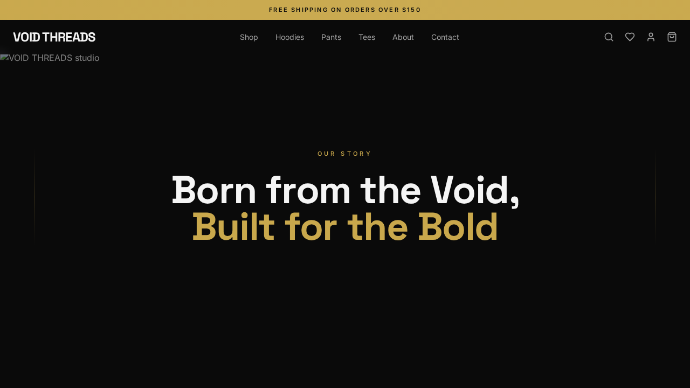
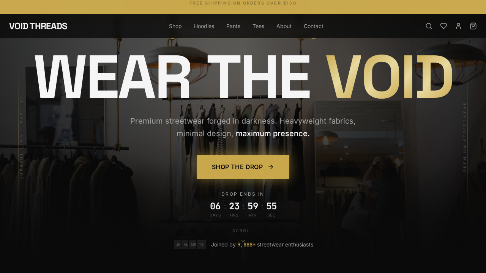
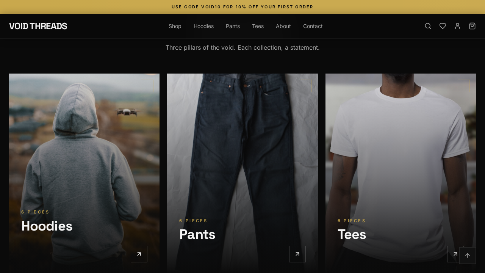

<p align="center">
  <strong>VOID THREADS</strong>
</p>

<h1 align="center">Premium Streetwear E-Commerce</h1>

<p align="center">
  Dark luxury aesthetic. Sales psychology-driven UX. Built to convert.
  <br />
  <a href="https://voidthreadsco.netlify.app"><strong>View Live Site</strong></a>
</p>

<p align="center">
  
  
  
  
  
  
</p>

---

## Screenshots

### Hero — Cinematic Landing

Full-viewport hero with Ken Burns background animation, word-by-word headline reveal, countdown timer, and magnetic gold CTA button.



### Featured Collections

Bento grid showcasing Hoodies, Pants, and Tees with hover zoom and gradient overlays.



### Social Proof & Live Notifications

Animated counters (10K+ customers, 4.7 rating, 44+ countries) with live purchase toast notifications.



### Product Catalog

Filter by size, color, and price. Sort by featured, newest, or top rated. Quick View modal and quick-add to cart on every card.



### Product Detail

Image gallery with hover-to-zoom, color/size selectors, live viewer count, stock indicators, and trust badges.



### Cross-Sell & Recommendations

"Complete the Look" outfit builder with bundle add-to-cart and "You Might Also Like" suggestions.



### About — Brand Story

Parallax hero, animated statistics, and brand values grid with scroll-triggered reveals.



### Mobile Responsive

Fully responsive from 320px to 1920px. Mobile-first navigation, sticky add-to-cart bar, and touch-optimized interactions.

<p align="center">
  
  
</p>

---

## Tech Stack

| Category | Technology | Purpose |
|----------|-----------|---------|
| **Runtime** | [Bun](https://bun.sh) 1.2 | Fast JS runtime & package manager |
| **Language** | TypeScript 5.9 | Type-safe development |
| **UI Library** | React 19 | Component-based UI |
| **Framework** | [TanStack Start](https://tanstack.com/start) v1 | Full-stack React framework with SSR |
| **Build Tool** | Vite 7 | Lightning-fast HMR & bundling |
| **Server** | Nitro 3 | Universal server engine (Netlify preset) |
| **Styling** | Tailwind CSS v4 | Utility-first CSS with `@theme` tokens |
| **Animations** | Framer Motion 11 | Scroll reveals, parallax, page transitions |
| **Icons** | Lucide React | Consistent icon system |
| **Carousel** | Embla Carousel | Performant touch-friendly carousels |
| **Validation** | Zod | Schema validation for forms & URL params |
| **Utilities** | clsx + tailwind-merge | Conditional class composition |

---

## Features

### Pages

| Page | Highlights |
|------|-----------|
| **Home** | Full-viewport hero, featured collections bento grid, trending carousel, social proof counters, UGC gallery, newsletter CTA, brand story teaser, trust badges |
| **Collections** | Filter by size/color/price, sort options, Quick View modal, product grid with hover image swap |
| **Product Detail** | Image gallery with zoom, color/size selectors, reviews section, "You Might Also Like", "Complete the Look" bundle CTA, recently viewed |
| **Cart** | Order summary, promo codes, "Complete Your Set" recommendations, free shipping progress bar |
| **About** | Parallax hero, brand story, animated stats, values grid |
| **Contact** | Contact form with Zod validation, FAQ accordion |

### Sales Psychology Engine

Conversion-driving features baked into every interaction:

- **Scarcity** — Countdown timers for drops, low stock indicators ("Only 3 left")
- **Social Proof** — Animated counters (10K+ customers, 4.8 rating), live purchase notifications ("Olivia from Tokyo just bought...")
- **FOMO** — Live viewer count ("25 people viewing this"), trending "sold today" indicators
- **Urgency** — Free shipping progress bar, limited-time promo codes
- **Cross-Selling** — "Complete the Look" outfit bundles with one-click add-all, "Complete Your Set" in cart
- **Retention** — Exit-intent popup (15% off), newsletter popup (10% off with timed + scroll triggers), wishlist with heart toggle
- **Trust** — Trust badges (free shipping, secure payment, 30-day returns, quality guarantee)

### UX & Interactions

- Full-screen search overlay with trending suggestions and live results
- Quick View modal on product cards
- Sticky mobile add-to-cart bar on product pages
- Back to top button
- Cursor-following spotlight effects on product cards
- Magnetic CTA button on hero
- Ken Burns slow-zoom background animation
- Word-by-word headline reveal with gold gradient accent
- Parallax scrolling sections
- Scroll-triggered staggered reveal animations
- Image hover swap on product cards
- Announcement bar with rotating messages + shimmer effect
- Responsive from 320px to 1920px
- `prefers-reduced-motion` support
- Keyboard navigation + ARIA labels

---

## Getting Started

### Prerequisites

- [Bun](https://bun.sh) (v1.2+)

### Install & Run

```bash
bun install
bun run dev
```

Open [http://localhost:3000](http://localhost:3000)

### Build for Production

```bash
bun run build
```

---

## Project Structure

```
src/
├── components/
│   ├── cart/           # Cart drawer, items, shipping bar, upsell
│   ├── filters/        # Filter sidebar, sort dropdown
│   ├── forms/          # Contact form, newsletter form
│   ├── layout/         # Navbar, footer, announcement bar
│   ├── popups/         # Newsletter + exit-intent popups
│   ├── product/        # Product card, gallery, info, cross-sell, quick view
│   ├── sections/       # Home page sections (hero, collections, trending, etc.)
│   ├── shared/         # Scroll reveal, search overlay, live toast, back-to-top
│   └── ui/             # Button, badge, modal, drawer, accordion, toast, etc.
├── context/            # Cart + UI state (React Context + useReducer)
├── data/               # Mock products (18), reviews (30), collections
├── hooks/              # useScrollPosition, useCountdown, useWishlist, etc.
├── routes/             # TanStack Router file-based routes
├── styles/             # Tailwind CSS with @theme design tokens
├── types/              # TypeScript interfaces (Product, CartItem, Review)
└── utils/              # cn(), formatPrice(), constants, SEO helpers
```

---

## Design System

| Token | Value | Usage |
|-------|-------|-------|
| `void` | `#0A0A0A` | Background |
| `smoke` | `#F5F5F5` | Primary text |
| `gold` | `#C9A84C` | Accent / CTA |
| `danger` | `#DC2626` | Urgency / sale badges |

| Font | Family | Usage |
|------|--------|-------|
| Heading | Space Grotesk | Headlines, nav, section titles |
| Body | Inter | Body text, descriptions |
| Mono | JetBrains Mono | Prices, countdown timers, badges |

**No border-radius anywhere** — sharp edges for the streetwear aesthetic.

---

## Deployment

Live at **[voidthreadsco.netlify.app](https://voidthreadsco.netlify.app)**

Deployed on **Netlify** with SSR via Nitro. The build produces:
- `dist/` — Static assets (CSS, JS, images)
- `.netlify/functions-internal/` — Server-side rendering functions

See [`netlify.toml`](netlify.toml) for build configuration.

---

## License

All rights reserved.
